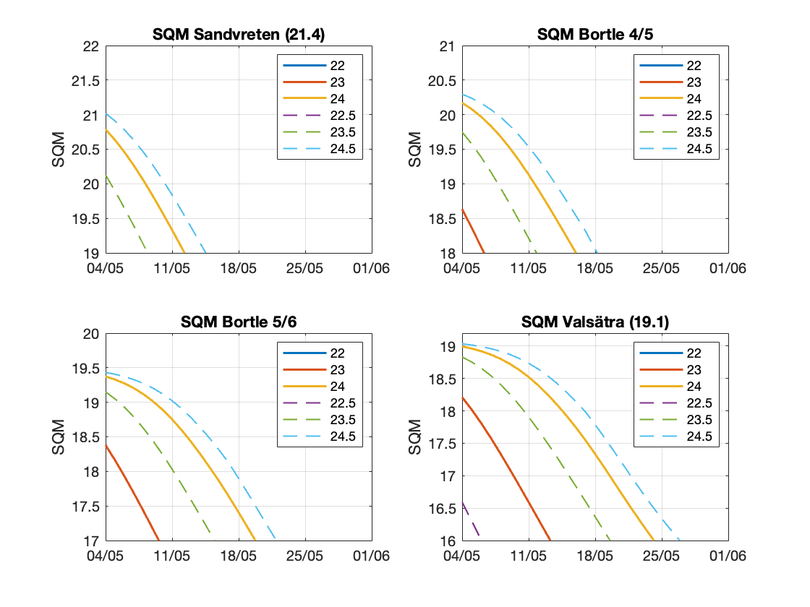

# Björns amatörastrosidor

## Innehåll

Här presenterar jag figurer på olika intressanta relationer i amatörstronomin. Sidan kommer att fyllas på och få en bättre formattering med menysystem, pedagogiska boxar mm. Framåt sommaren kanske jag har lagt in några kalkylatorer om jag får det att fungera.

Håll till godo med detta så länge!

- [SQM](#SQM)

## SQM

### Teori

Det finns en relation mellan solens vinkel under horisonten, "solar depression", och [Sky Brightness](https://en.wikipedia.org/wiki/Sky_brightness), mätt med en Sky Quality Meter (SQM). SQM används även som enhet för magnitud per kvadratbågsekund för just himmelsljusheten, ej att förväxla med ytljusstyrkan hos astronomiska objekt som förkortas SB (Surface brightness).

Nedan syns en graf från ekvationen (behöver hitta referensen) där jag också använt definitionen för Bortle-skalan. Talen till höger anger Bortle för arean mellan kurvorna, som alltså är gränsfallen. Väl att märka är att man når sin Bortle-nivå när man närmar sig 18° under horisonten men att det sker tidigare ju högre Bortle man har.

*SQM som funktion av "solar depression". Linjer är för olika Bortle*

### Grafer

Här presenteras grafer på solens vinkel under horisonten och SQM om funktioner av datum och tid. Jag har bara tagit med maj och till viss del juni för att det inte ska bli för plottrigt.

#### Konturgraf: Solens djup under horistonten i maj-juni

#### Konturgraf: SQM i maj

#### Är det värt att åka ut på landet?

#### När blir det mörkt?

