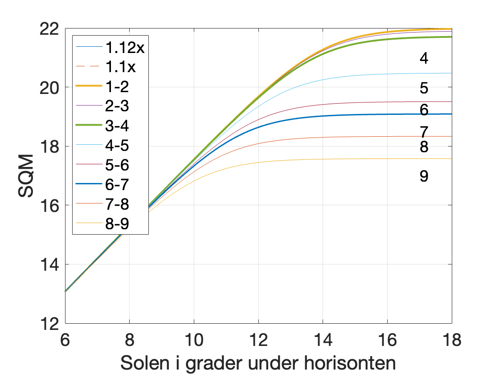
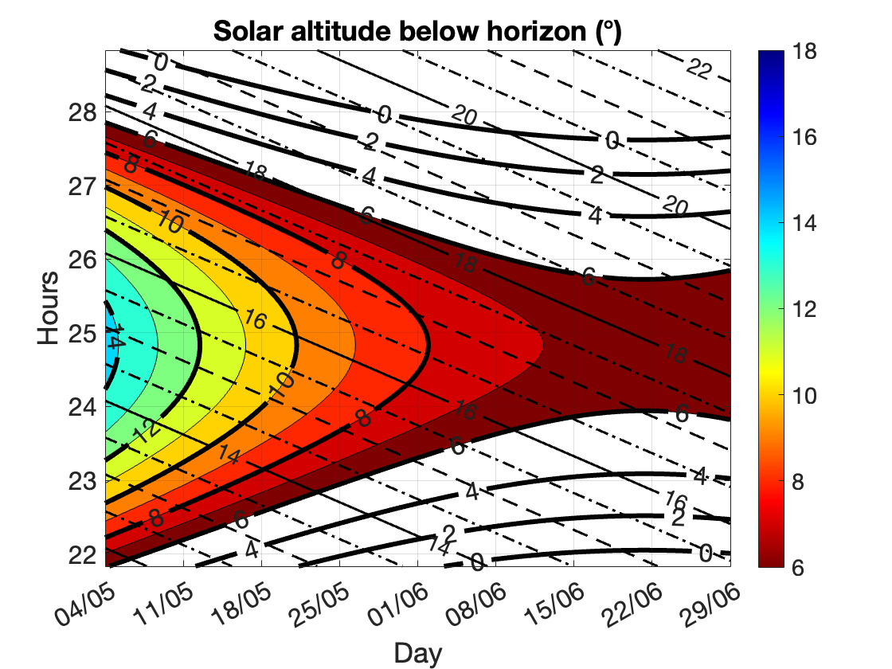
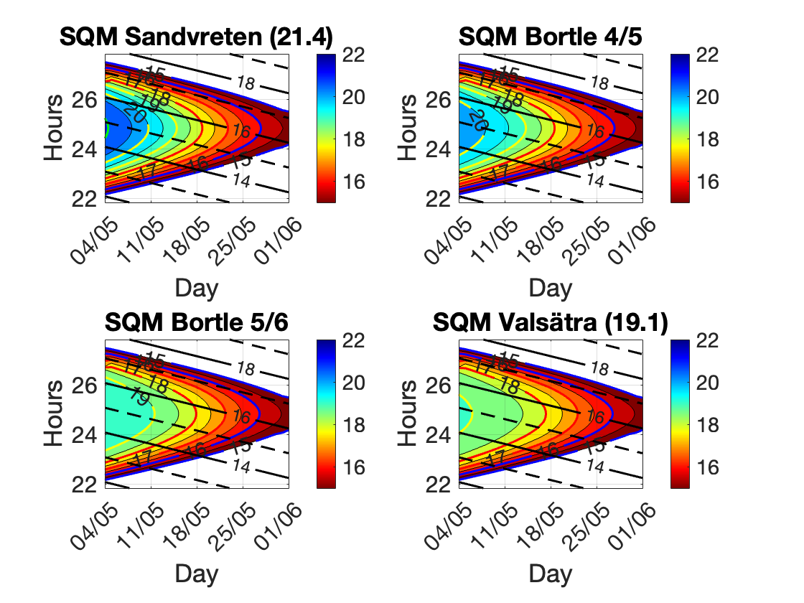
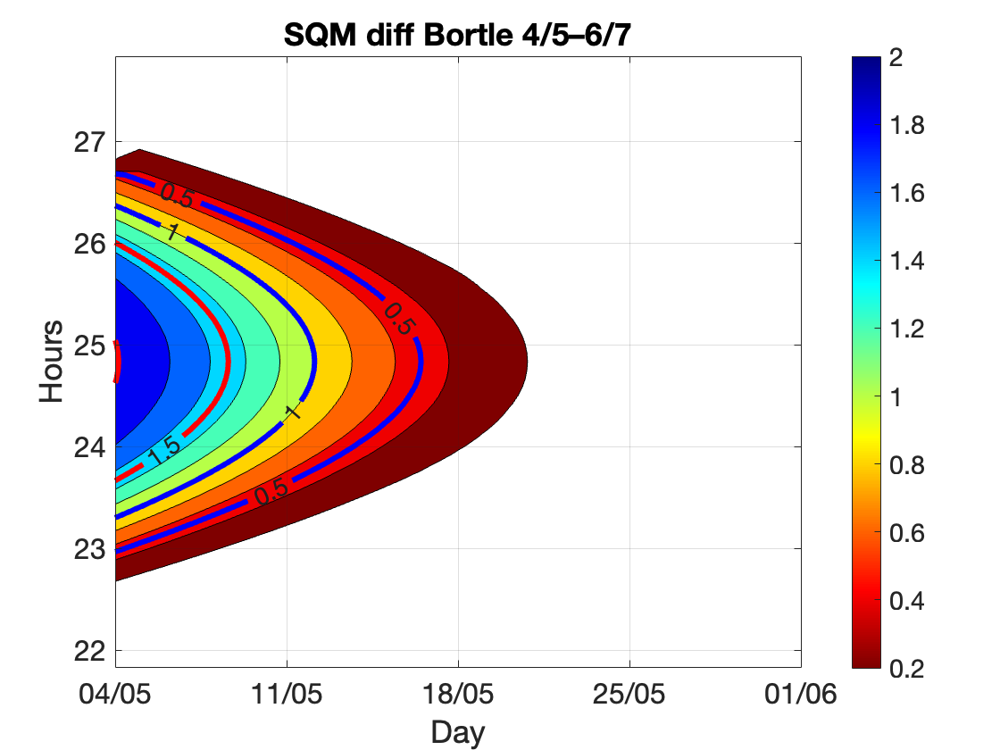
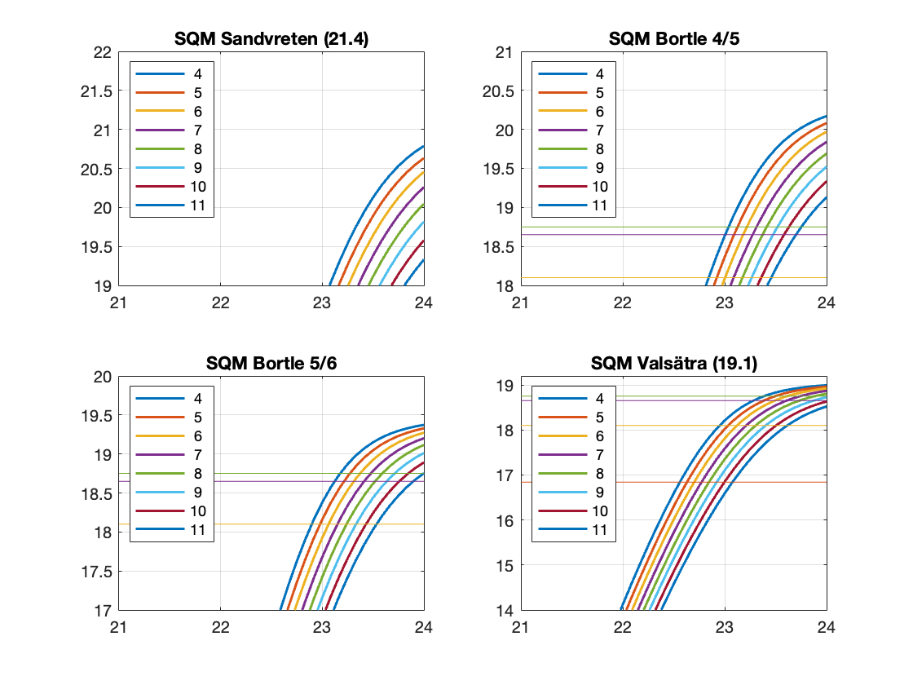

# Björns amatörastrosidor

## Innehåll

- [SQM](#SQM]

## SQM

### Teori

### Grafer

#### Konturgraf: Solens djup under horistonten i maj-juni

#### Konturgraf: SQM i maj

#### Är det värt att åka ut på landet?

#### När blir det mörkt?

